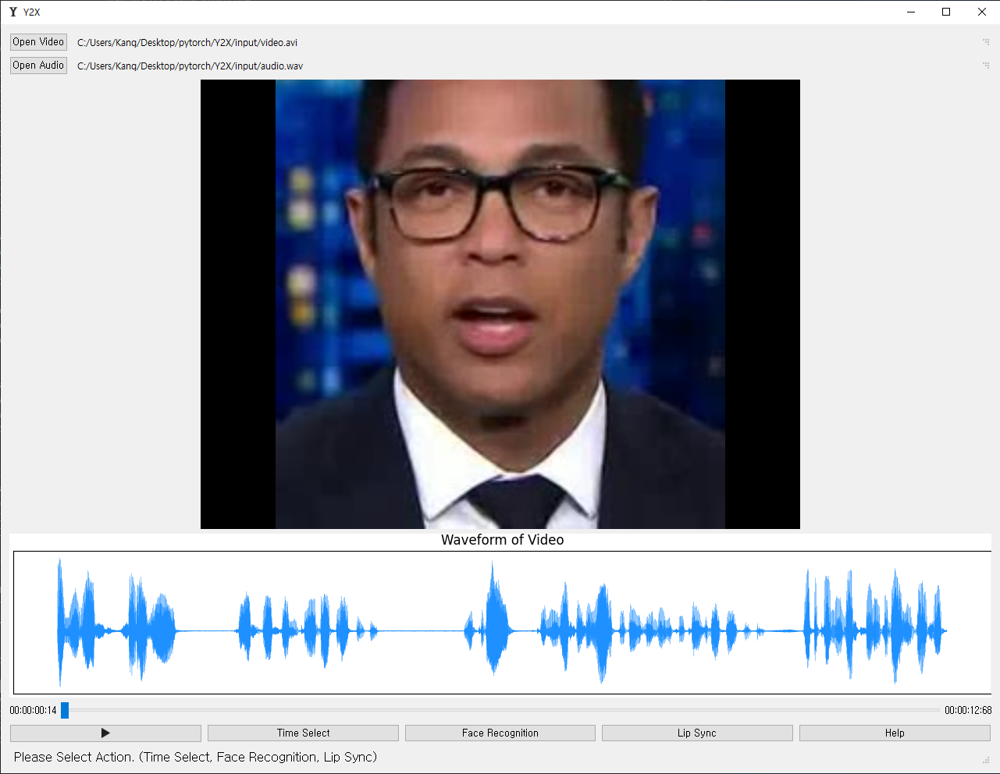

# **Wav2Lip_Windows_GUI**: *Program Using PyQT5*

This is a capstone work of Y2X majoring in electronics and communication engineering at [Kwangwoon University](www.kw.ac.kr) in South Korea.

-----------
**Y2X**
-----------
- Program

-----------
**Topic**
-----------
 - The Wav2Lip used by this program can be found [here](https://github.com/Rudrabha/Wav2Lip).
 - 만약 한국어 분석자료가 필요하다면 [여기](https://github.com/Minjun-KANG/Wav2Lip)를 통해 각 소스코드에 주석을 확인하세요. 추가적으로 코드분석은 [블로그](https://blog.naver.com/ansalsdlf/222277423497)에서 확인할 수 있습니다.
 - Windows 10 Home support.
 - Recommended operation for .avi and .wav files.
 - I used the screen resolution 1920 * 1080.
 - python version 3.8.8 (default, Apr 13 2021, 15:08:03) [MSC v.1916 64 bit (AMD64)]
 - conda 4.10.1
-----------
**Preparations**
-----------
 - [K-Lite codec](https://codecguide.com/download_k-lite_codec_pack_basic.htm) is required to operate .mp4 files in the program. (Related to Canvas in PyQT5). 
 - [Wav2Lip_Windows_GUI/src/Wav2Lip/checkpoints/wav2lip_gan.pth](https://iiitaphyd-my.sharepoint.com/personal/radrabha_m_research_iiit_ac_in/_layouts/15/onedrive.aspx?id=%2Fpersonal%2Fradrabha%5Fm%5Fresearch%5Fiiit%5Fac%5Fin%2FDocuments%2FWav2Lip%5FModels%2Fwav2lip%5Fgan%2Epth&parent=%2Fpersonal%2Fradrabha%5Fm%5Fresearch%5Fiiit%5Fac%5Fin%2FDocuments%2FWav2Lip%5FModels&originalPath=aHR0cHM6Ly9paWl0YXBoeWQtbXkuc2hhcmVwb2ludC5jb20vOnU6L2cvcGVyc29uYWwvcmFkcmFiaGFfbV9yZXNlYXJjaF9paWl0X2FjX2luL0Vkakk3YlpsZ0FwTXFzVm9FVVVYcExzQnhxWGJuNXo4VlRtb3hwNTVZTkRjSUE%5FcnRpbWU9SWlFR0lBZ24yVWc) is required. 
 - Download the library by referring to requirements.

-----------
**Problem**
-----------
 - Problem

-----------
**File Hierarchy**

'''
root
│  requirements.txt\n
│  result.avi
│  
├─input
│      audio.wav
│      video.avi
│      
├─resource
│      icon.ico
│      icon.png
│      icon2.png
│      icon3.png
│      
├─src
│  │  e2_timeSelect.py
│  │  e3_faceRecognition.py
│  │  e5_Help.py
│  │  face_classifier.py
│  │  main.py
│  │  person_db.py
│  │  
│  ├─Wav2Lip
│  │  │  .gitignore
│  │  │  audio.py
│  │  │  color_syncnet_train.py
│  │  │  hparams.py
│  │  │  hq_wav2lip_train.py
│  │  │  inference.py
│  │  │  preprocess.py
│  │  │  README.md
│  │  │  requirements.txt
│  │  │  wav2lip_train.py
│  │  │  __init__.py
│  │  │  
│  │  ├─checkpoints
│  │  │      .gitattributes
│  │  │      README.md
│  │  │      wav2lip_gan.pth
│  │  │      
│  │  ├─evaluation
│  │  │  │  gen_videos_from_filelist.py
│  │  │  │  README.md
│  │  │  │  real_videos_inference.py
│  │  │  │  
│  │  │  ├─scores_LSE
│  │  │  │      calculate_scores_LRS.py
│  │  │  │      calculate_scores_real_videos.py
│  │  │  │      calculate_scores_real_videos.sh
│  │  │  │      SyncNetInstance_calc_scores.py
│  │  │  │      
│  │  │  └─test_filelists
│  │  │      │  lrs2.txt
│  │  │      │  lrs3.txt
│  │  │      │  lrw.txt
│  │  │      │  README.md
│  │  │      │  
│  │  │      └─ReSyncED
│  │  │              random_pairs.txt
│  │  │              tts_pairs.txt
│  │  │              
│  │  ├─face_detection
│  │  │  │  api.py
│  │  │  │  models.py
│  │  │  │  README.md
│  │  │  │  utils.py
│  │  │  │  __init__.py
│  │  │  │  
│  │  │  ├─detection
│  │  │  │  │  core.py
│  │  │  │  │  __init__.py
│  │  │  │  │  
│  │  │  │  ├─sfd
│  │  │  │  │  │  bbox.py
│  │  │  │  │  │  detect.py
│  │  │  │  │  │  net_s3fd.py
│  │  │  │  │  │  s3fd.pth
│  │  │  │  │  │  sfd_detector.py
│  │  │  │  │  │  __init__.py
│  │  │  │  │  │  
│  │  │  │  │  └─__pycache__
│  │  │  │  │          bbox.cpython-38.pyc
│  │  │  │  │          detect.cpython-38.pyc
│  │  │  │  │          net_s3fd.cpython-38.pyc
│  │  │  │  │          sfd_detector.cpython-38.pyc
│  │  │  │  │          __init__.cpython-38.pyc
│  │  │  │  │          
│  │  │  │  └─__pycache__
│  │  │  │          core.cpython-38.pyc
│  │  │  │          __init__.cpython-38.pyc
│  │  │  │          
│  │  │  └─__pycache__
│  │  │          api.cpython-38.pyc
│  │  │          models.cpython-38.pyc
│  │  │          utils.cpython-38.pyc
│  │  │          __init__.cpython-38.pyc
│  │  │          
│  │  ├─filelists
│  │  │      README.md
│  │  │      
│  │  ├─models
│  │  │  │  conv.py
│  │  │  │  syncnet.py
│  │  │  │  wav2lip.py
│  │  │  │  __init__.py
│  │  │  │  
│  │  │  └─__pycache__
│  │  │          conv.cpython-38.pyc
│  │  │          syncnet.cpython-38.pyc
│  │  │          wav2lip.cpython-38.pyc
│  │  │          __init__.cpython-38.pyc
│  │  │          
│  │  ├─results
│  │  │      README.md
│  │  │      
│  │  ├─temp
│  │  │      README.md
│  │  │      result.avi
│  │  │      
│  │  └─__pycache__
│  │          audio.cpython-38.pyc
│  │          hparams.cpython-38.pyc
│  │          inference.cpython-38.pyc
│  │          __init__.cpython-38.pyc
│  │          
│  └─__pycache__
│          e2_timeSelect.cpython-38.pyc
│          e3_faceRecognition.cpython-38.pyc
│          e5_Help.cpython-38.pyc
│          popup.cpython-38.pyc
│          roi.cpython-38.pyc
│          VideoCropDialog.cpython-38.pyc
│          
└─temp
　  │  faulty_frame.jpg
　  │  original.wav
　  │  result.avi
　  │  
　  └─Multi
　      │  person_div.jpg
　      │  
　      ├─A 
　      │      1.jpg
　      │      
　      └─B
　             1.jpg
              

'''

-----------

-----------
**GUI Layout**
-----------
 - Layout

 - By color, the variable names begin with a, b, c, d, e, and f. (green is a)

-----------
**icon**
-----------
 - My friend made icon in 10 seconds.

